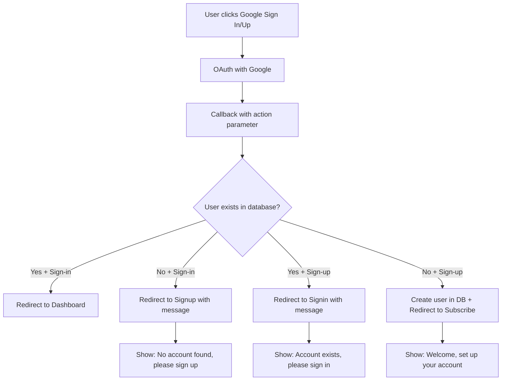

# Production Google Authentication Flow

## Overview

This document describes the production-level Google authentication flow implemented to handle both new and existing users seamlessly. The system now intelligently detects whether a user exists in the database and provides appropriate messaging and redirection.

## Key Features

### 1. Intelligent User Detection
- **Sign-in Flow**: If user doesn't exist → redirect to signup with informative message
- **Sign-up Flow**: If user already exists → redirect to signin with informative message
- **Automatic User Creation**: New users are automatically created in the database with trial status

### 2. User-Friendly Messaging
- **Blue messages**: Informational (account exists, needs signup)
- **Red messages**: Error states
- **Pre-filled email**: Email is automatically filled when redirected

### 3. Production-Level Error Handling
- Comprehensive error handling in all auth flows
- Graceful fallbacks for edge cases
- Proper TypeScript type safety

## Implementation Details

### Files Modified

1. **`app/api/auth/google/route.ts`** (NEW)
   - API endpoint for checking user existence
   - Handles both signin and signup actions
   - Returns appropriate redirect URLs and messages

2. **`app/auth/callback/route.ts`**
   - Enhanced callback handler with user existence checking
   - Automatic user creation for new Google auth users
   - Intelligent redirection based on user status

3. **`app/auth/signin/page.tsx`**
   - Updated Google auth redirect to include action parameter
   - Added URL parameter handling for messages and pre-filled email
   - Enhanced error display with different styles for different message types

4. **`app/auth/signup/page.tsx`**
   - Updated Google auth redirect to include action parameter
   - Added URL parameter handling for messages and pre-filled email
   - Enhanced error display with different styles for different message types

### Authentication Flow Logic



### Database Integration

The system automatically creates users in the `public.users` table with:
- **Trial Status**: `trialing` for new users
- **Trial Duration**: 7 days from creation
- **Session Limit**: 30 minutes for trial users
- **Automatic Timestamps**: `trial_started_at` and `trial_expires_at`

### URL Parameters

The system uses URL parameters to pass information between pages:

- `message`: Informational or error message to display
- `email`: Pre-fill email field when redirecting
- `action`: `signin` or `signup` to determine flow
- `next`: Destination after successful authentication

## User Experience Scenarios

### Scenario 1: New User Tries to Sign In
1. User clicks "Continue with Google" on sign-in page
2. Google OAuth completes successfully
3. System checks database - user doesn't exist
4. Redirects to signup page with message: "No account found with this email. Please sign up first."
5. Email field is pre-filled
6. User can complete signup process

### Scenario 2: Existing User Tries to Sign Up
1. User clicks "Continue with Google" on sign-up page
2. Google OAuth completes successfully
3. System checks database - user already exists
4. Redirects to signin page with message: "Account already exists. Please sign in instead."
5. Email field is pre-filled
6. User can complete signin process

### Scenario 3: New User Signs Up Successfully
1. User clicks "Continue with Google" on sign-up page
2. Google OAuth completes successfully
3. System checks database - user doesn't exist
4. Creates user in database with trial status
5. Redirects to subscription page
6. User can start their 7-day trial

### Scenario 4: Existing User Signs In Successfully
1. User clicks "Continue with Google" on sign-in page
2. Google OAuth completes successfully
3. System checks database - user exists
4. Redirects to dashboard
5. User can access their account

## Security Considerations

### 1. Database Security
- Uses Supabase RLS (Row Level Security) policies
- Users can only access their own data
- Service role permissions for system operations

### 2. Authentication Security
- OAuth 2.0 with Google
- Secure session management
- Proper token handling

### 3. Error Handling
- No sensitive information exposed in error messages
- Graceful fallbacks for all edge cases
- Comprehensive logging for debugging

## Testing Checklist

### Manual Testing
- [ ] New user Google sign-in → redirects to signup with message
- [ ] Existing user Google sign-up → redirects to signin with message
- [ ] New user Google sign-up → creates user and redirects to subscribe
- [ ] Existing user Google sign-in → redirects to dashboard
- [ ] Error messages display correctly with appropriate styling
- [ ] Email fields are pre-filled when redirected
- [ ] All edge cases handled gracefully

### Automated Testing
- [ ] API endpoint returns correct responses
- [ ] Database operations complete successfully
- [ ] URL parameters are handled correctly
- [ ] Error states are handled properly

## Production Deployment

### Environment Variables Required
```bash
NEXT_PUBLIC_SUPABASE_URL=your_supabase_url
NEXT_PUBLIC_SUPABASE_ANON_KEY=your_supabase_anon_key
SUPABASE_SERVICE_ROLE_KEY=your_service_role_key
```

### Google OAuth Configuration
1. Configure Google OAuth in Supabase dashboard
2. Set authorized redirect URIs:
   - `https://minbarai.com/auth/callback`
   - `http://localhost:3000/auth/callback` (for development)

### Database Setup
1. Run the database schema from `database.sql`
2. Ensure RLS policies are enabled
3. Verify triggers are working for user creation

## Monitoring and Logging

### Key Metrics to Monitor
- Google OAuth success/failure rates
- User creation success rates
- Redirect accuracy
- Error message frequency

### Logging Points
- OAuth callback processing
- Database user existence checks
- User creation operations
- Redirect decisions

## Future Enhancements

### Potential Improvements
1. **Analytics Integration**: Track user flow patterns
2. **A/B Testing**: Test different messaging approaches
3. **Social Login Expansion**: Add other OAuth providers
4. **User Onboarding**: Enhanced onboarding flow for new users
5. **Retry Logic**: Automatic retry for failed operations

### Performance Optimizations
1. **Caching**: Cache user existence checks
2. **Database Indexing**: Optimize user lookup queries
3. **CDN**: Serve static assets from CDN
4. **Rate Limiting**: Implement rate limiting for auth endpoints

## Troubleshooting

### Common Issues

1. **User not created in database**
   - Check Supabase triggers are enabled
   - Verify RLS policies allow user creation
   - Check service role permissions

2. **Incorrect redirects**
   - Verify URL parameter handling
   - Check callback route logic
   - Ensure action parameter is passed correctly

3. **Error messages not displaying**
   - Check URL parameter parsing
   - Verify error state management
   - Ensure proper styling classes

### Debug Steps

1. Check browser network tab for API calls
2. Verify Supabase logs for database operations
3. Check server logs for callback processing
4. Test with different user scenarios

## Conclusion

This production-level Google authentication flow provides a seamless user experience while maintaining security and reliability. The system intelligently handles both new and existing users, provides clear messaging, and ensures proper database integration.

The implementation follows best practices for:
- Security (RLS, OAuth 2.0, proper error handling)
- User Experience (clear messaging, pre-filled forms, appropriate redirects)
- Reliability (comprehensive error handling, graceful fallbacks)
- Maintainability (clear code structure, comprehensive documentation)
